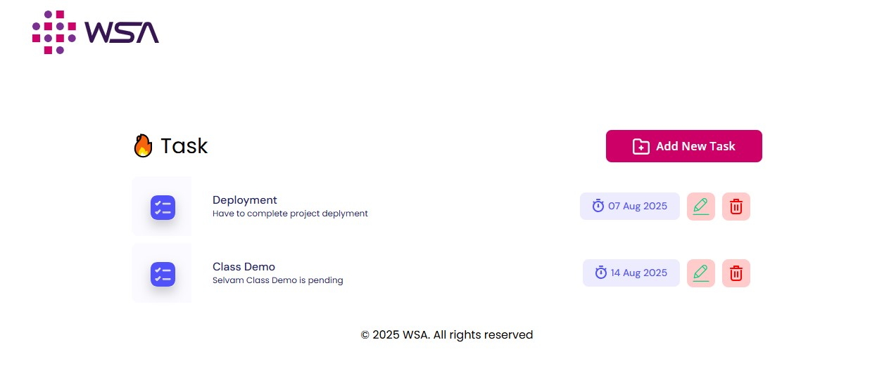
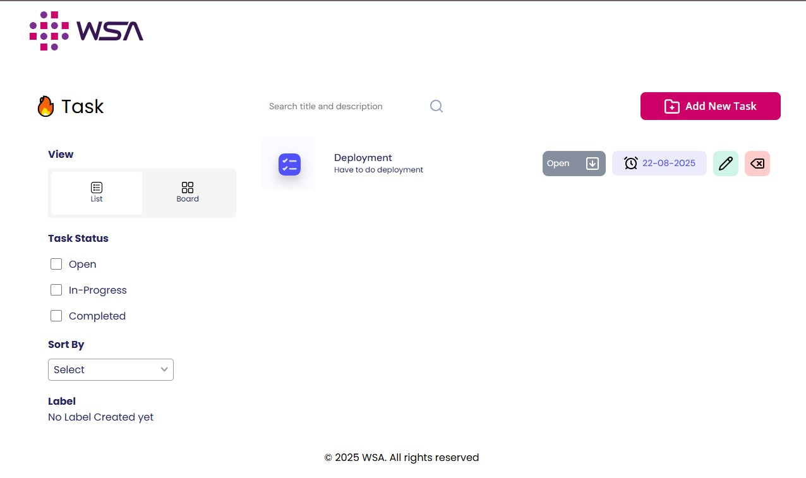

#  WSA To-Do List Application

A full-stack **To-Do List Web Application** built using the **MERN stack** (MongoDB, Express.js, React.js, Node.js). This project is split into two levels of complexity — each implemented with separate frontend and backend setups.

---

## 🛠️ Tech Stack

- **Frontend:** React.js, HTML5, CSS3, JavaScript
- **Backend:** Node.js, Express.js
- **Database:** MongoDB + MongoDB Compass
- **Other Tools:** Postman, Git, npm

---
## 🧰 Prerequisites

- [Node.js](https://nodejs.org/)
- [MongoDB + Compass](https://www.mongodb.com/products/compass)
- Git
- npm
 ---

## 📁 Folder Structure

├── level1 
│ ├── frontend 
│ └── backend 
├── level2 
│ ├── frontend 
│ └── backend 

Each level contains its own **frontend** and **backend** codebases. You must run both parts simultaneously for full functionality.

---

## ✅ Level 1

- Setup project structure and reusable components.
- Develop CRUD UI.
- Integrate backend APIs using Postman.
  
✨ **Key Features**:

- Add, update, and delete ToDo items.
- Clean UI for task management.
- REST API integration.
- Reusable React components.
- Error handling for network calls.

## Screenshot: 

**Live Demo** : [Click here to view Level 1](https://wsa-todo-app-level1.netlify.app/)

---

## ✅ Level 2

- Extend UI with new components (Search, Board View).
- Add advanced features: Sorting, Filtering, Status Dropdown.
- Manage labels and task statuses with enhanced APIs.

✨ **Key Features**:

 - Search ToDos
 - Sorting and Filtering
 - Label Management
 - Status Tracking (Completed, Pending)
 - Board View & Sidebar for Task Lists.

## Screenshot: 

**Live Demo** : [Click here to view Level 2](https://wsa-todo-app-level2.netlify.app/)

---
## 📌 How to Run Locally

1. **Clone the Repository:**  
   **git clone** https://github.com/EmertxeInfoTech/wsa-todo-app.git 
   **cd** your-project-directory

2. **Install Dependencies:**  
   **cd** level1/frontend 
   **npm** install 
   **cd** level1/backend 
   **npm** install
   
3. **Follow the same for level 2 also**  

4. **In each backend folder, create a .env file:**  
   **PORT**=8000 
   **MONGODB_URL**=mongodb://localhost:27017/wsa_todo
   
6. **In each frontend folder, create a .env file:**  
   **REACT_APP_API_BASE_URL**=http://localhost:8000  

7. **Start both frontend and backend for each level in separate terminals.**  
   **Backend** 
   **cd** level1/backend  
   **npm** start

   **Frontend** 
   **cd** level1/frontend 
   **npm** start

8. **Follow the same for level 2 also**

## 📄 License
© 2023 WSA. All rights reserved.

